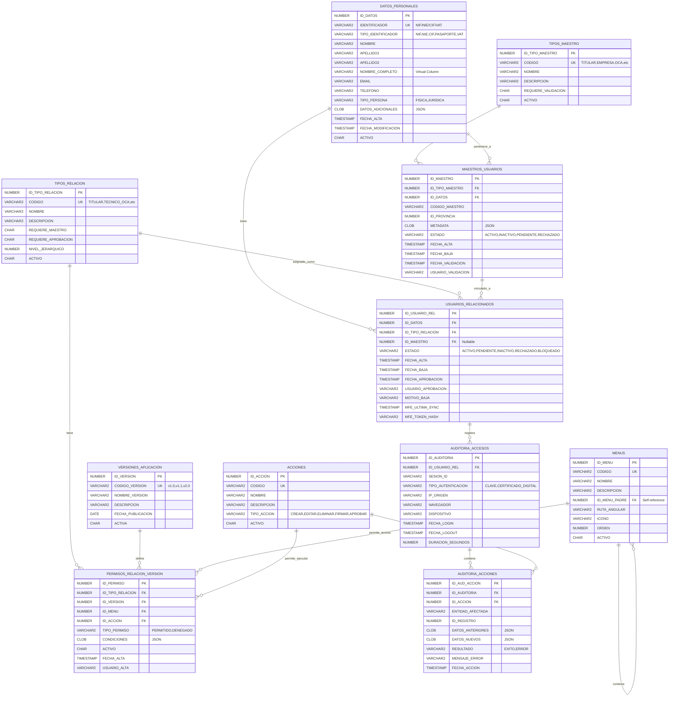

# 📊 DIAGRAMA UML - GESTIÓN DE USUARIOS RASMIA/INDAR

**Fecha:** 21 de Noviembre de 2025  
**Versión:** 1.0  
**Relacionado con:** PropuestaFinal_GestionUsuarios_RASMIA.md

---

## 🗂️ DIAGRAMA ENTIDAD-RELACIÓN

Este diagrama muestra las 11 tablas principales organizadas en 5 capas lógicas con sus relaciones.



---

## 🔗 DESCRIPCIÓN DE RELACIONES

### **CAPA 1: Datos Personales**

| Tabla | Relación | Descripción |
|-------|----------|-------------|
| `DATOS_PERSONALES` | Base | Tabla central sin dependencias. Almacena personas físicas y jurídicas |

---

### **CAPA 2: Maestros (Entidades)**

| Relación | Cardinalidad | Descripción |
|----------|--------------|-------------|
| `TIPOS_MAESTRO` → `MAESTROS_USUARIOS` | 1:N | Un tipo de maestro puede tener muchos maestros |
| `DATOS_PERSONALES` → `MAESTROS_USUARIOS` | 1:N | Unos datos personales pueden ser varios maestros (ej: persona es titular y tiene empresa) |

**Ejemplo:** Juan López (DATOS_PERSONALES) puede ser:
- Maestro TITULAR (tipo: TITULAR)
- Maestro EMPRESA "Consultores López" (tipo: EMPRESA)

---

### **CAPA 3: Usuarios y Relaciones (Perfiles)**

| Relación | Cardinalidad | Descripción |
|----------|--------------|-------------|
| `DATOS_PERSONALES` → `USUARIOS_RELACIONADOS` | 1:N | Una persona puede tener múltiples perfiles |
| `TIPOS_RELACION` → `USUARIOS_RELACIONADOS` | 1:N | Un tipo de relación puede asignarse a muchos usuarios |
| `MAESTROS_USUARIOS` → `USUARIOS_RELACIONADOS` | 1:N | Un maestro puede tener múltiples usuarios relacionados |

**Ejemplo:** Juan López (ID_DATOS=1) tiene 3 perfiles:
1. TITULAR individual (sin maestro)
2. TITULAR de empresa (ID_MAESTRO=2)
3. TECNICO_OCA en OCA Norte (ID_MAESTRO=10)

---

### **CAPA 4: Permisos y Versiones**

| Relación | Cardinalidad | Descripción |
|----------|--------------|-------------|
| `MENUS` → `MENUS` | 1:N | Jerarquía de menús (menú padre/hijo) |
| `TIPOS_RELACION` → `PERMISOS_RELACION_VERSION` | 1:N | Un perfil tiene muchos permisos |
| `VERSIONES_APLICACION` → `PERMISOS_RELACION_VERSION` | 1:N | Una versión define muchos permisos |
| `MENUS` → `PERMISOS_RELACION_VERSION` | 1:N | Un menú puede tener permisos en varios perfiles |
| `ACCIONES` → `PERMISOS_RELACION_VERSION` | 1:N | Una acción puede permitirse en varios contextos |

**Lógica de permisos:**
```
PERMISO = PERFIL + VERSIÓN + MENÚ + ACCIÓN
```

**Ejemplo:**
- Perfil: TECNICO_OCA
- Versión: v1.0
- Menú: MENU_EXPEDIENTES
- Acción: ACCION_FIRMAR_EXPEDIENTE
- Resultado: PERMITIDO

---

### **CAPA 5: Auditoría**

| Relación | Cardinalidad | Descripción |
|----------|--------------|-------------|
| `USUARIOS_RELACIONADOS` → `AUDITORIA_ACCESOS` | 1:N | Un usuario registra múltiples accesos |
| `AUDITORIA_ACCESOS` → `AUDITORIA_ACCIONES` | 1:N | Un acceso contiene múltiples acciones |
| `ACCIONES` → `AUDITORIA_ACCIONES` | 1:N | Una acción se registra múltiples veces |

**Flujo de auditoría:**
1. Usuario accede → `AUDITORIA_ACCESOS` (LOGIN)
2. Usuario realiza acciones → `AUDITORIA_ACCIONES` (múltiples)
3. Usuario sale → `AUDITORIA_ACCESOS` (LOGOUT actualiza duración)

---

## 📋 CARDINALIDADES DETALLADAS

### Notación:
- **1:1** = Uno a uno
- **1:N** = Uno a muchos
- **N:M** = Muchos a muchos (requiere tabla intermedia)

### Tabla de Relaciones:

| Tabla Origen | Relación | Tabla Destino | Cardinalidad | Obligatoria |
|--------------|----------|---------------|--------------|-------------|
| TIPOS_MAESTRO | tiene | MAESTROS_USUARIOS | 1:N | Sí |
| DATOS_PERSONALES | pertenece_a | MAESTROS_USUARIOS | 1:N | Sí |
| DATOS_PERSONALES | tiene | USUARIOS_RELACIONADOS | 1:N | Sí |
| TIPOS_RELACION | asignado_como | USUARIOS_RELACIONADOS | 1:N | Sí |
| MAESTROS_USUARIOS | vinculado_a | USUARIOS_RELACIONADOS | 1:N | No (nullable) |
| MENUS | contiene | MENUS | 1:N | No (self-reference) |
| TIPOS_RELACION | tiene | PERMISOS_RELACION_VERSION | 1:N | Sí |
| VERSIONES_APLICACION | define | PERMISOS_RELACION_VERSION | 1:N | Sí |
| MENUS | permite_acceso | PERMISOS_RELACION_VERSION | 1:N | Sí |
| ACCIONES | permite_ejecutar | PERMISOS_RELACION_VERSION | 1:N | Sí |
| USUARIOS_RELACIONADOS | registra | AUDITORIA_ACCESOS | 1:N | Sí |
| AUDITORIA_ACCESOS | contiene | AUDITORIA_ACCIONES | 1:N | Sí |
| ACCIONES | registra | AUDITORIA_ACCIONES | 1:N | Sí |

---

## 🎯 ÍNDICES Y CONSTRAINTS

### Claves Primarias (PK):
- Todas las tablas usan `GENERATED ALWAYS AS IDENTITY`
- Secuencias automáticas de Oracle 12c+

### Claves Únicas (UK):
- `DATOS_PERSONALES.IDENTIFICADOR`
- `TIPOS_MAESTRO.CODIGO`
- `TIPOS_RELACION.CODIGO`
- `VERSIONES_APLICACION.CODIGO_VERSION`
- `MENUS.CODIGO`
- `ACCIONES.CODIGO`
- `USUARIOS_RELACIONADOS(ID_DATOS, ID_TIPO_RELACION, COALESCE(ID_MAESTRO,-1))`
- `PERMISOS_RELACION_VERSION(ID_TIPO_RELACION, ID_VERSION, ID_MENU, ID_ACCION)`

### Índices de Búsqueda:
```sql
-- Búsquedas frecuentes
IDX_DP_IDENTIFICADOR ON DATOS_PERSONALES(IDENTIFICADOR)
IDX_USUREL_DATOS ON USUARIOS_RELACIONADOS(ID_DATOS)
IDX_PERM_TIPO ON PERMISOS_RELACION_VERSION(ID_TIPO_RELACION)
IDX_AUD_USUARIO ON AUDITORIA_ACCESOS(ID_USUARIO_REL)

-- Búsquedas por estado
IDX_MAESTRO_ESTADO ON MAESTROS_USUARIOS(ESTADO)
IDX_USUREL_ESTADO ON USUARIOS_RELACIONADOS(ESTADO)

-- Búsquedas temporales
IDX_AUD_FECHA ON AUDITORIA_ACCESOS(FECHA_LOGIN)
IDX_AUDACC_FECHA ON AUDITORIA_ACCIONES(FECHA_ACCION)
```

---

## 🔍 CONSULTAS TIPO

### 1. Obtener todos los perfiles de un usuario:
```sql
SELECT 
    dp.NOMBRE_COMPLETO,
    tr.NOMBRE AS PERFIL,
    m.NOMBRE AS ENTIDAD,
    ur.ESTADO
FROM DATOS_PERSONALES dp
JOIN USUARIOS_RELACIONADOS ur ON dp.ID_DATOS = ur.ID_DATOS
JOIN TIPOS_RELACION tr ON ur.ID_TIPO_RELACION = tr.ID_TIPO_RELACION
LEFT JOIN MAESTROS_USUARIOS mu ON ur.ID_MAESTRO = mu.ID_MAESTRO
LEFT JOIN DATOS_PERSONALES m ON mu.ID_DATOS = m.ID_DATOS
WHERE dp.IDENTIFICADOR = '12345678Z'
  AND ur.ESTADO = 'ACTIVO';
```

### 2. Obtener permisos efectivos de un usuario:
```sql
SELECT 
    m.NOMBRE AS MENU,
    a.NOMBRE AS ACCION,
    prv.TIPO_PERMISO
FROM USUARIOS_RELACIONADOS ur
JOIN TIPOS_RELACION tr ON ur.ID_TIPO_RELACION = tr.ID_TIPO_RELACION
JOIN PERMISOS_RELACION_VERSION prv ON tr.ID_TIPO_RELACION = prv.ID_TIPO_RELACION
JOIN VERSIONES_APLICACION va ON prv.ID_VERSION = va.ID_VERSION
JOIN MENUS m ON prv.ID_MENU = m.ID_MENU
JOIN ACCIONES a ON prv.ID_ACCION = a.ID_ACCION
WHERE ur.ID_USUARIO_REL = 123
  AND va.ACTIVA = 'Y'
  AND prv.TIPO_PERMISO = 'PERMITIDO';
```

### 3. Auditoría de acciones de un usuario:
```sql
SELECT 
    aa.FECHA_LOGIN,
    aa.IP_ORIGEN,
    ac.NOMBRE AS ACCION,
    aac.ENTIDAD_AFECTADA,
    aac.RESULTADO
FROM AUDITORIA_ACCESOS aa
JOIN AUDITORIA_ACCIONES aac ON aa.ID_AUDITORIA = aac.ID_AUDITORIA
JOIN ACCIONES ac ON aac.ID_ACCION = ac.ID_ACCION
WHERE aa.ID_USUARIO_REL = 123
  AND aa.FECHA_LOGIN >= TRUNC(SYSDATE) - 30
ORDER BY aa.FECHA_LOGIN DESC, aac.FECHA_ACCION DESC;
```

---

## 💡 CARACTERÍSTICAS DEL MODELO

### ✅ Ventajas:

1. **Sin duplicidad**: Datos personales únicos en una tabla
2. **Múltiples perfiles**: Un usuario puede tener N perfiles
3. **Versionado**: Permisos evolucionan con versiones de aplicación
4. **Flexibilidad**: JSON para datos específicos sin modificar esquema
5. **Auditoría completa**: Particionada por meses para rendimiento
6. **Escalabilidad**: Añadir perfiles/permisos sin cambiar código
7. **Integridad**: Foreign keys + constraints garantizan consistencia
8. **Performance**: Índices optimizados para consultas frecuentes

### ⚠️ Consideraciones:

1. **Columnas JSON**: Requieren Oracle 12c+ para validación nativa
2. **Particionado**: AUDITORIA_ACCESOS usa particionado INTERVAL
3. **Virtual Columns**: NOMBRE_COMPLETO calculada automáticamente
4. **Nullable FK**: USUARIOS_RELACIONADOS.ID_MAESTRO puede ser NULL
5. **Self-reference**: MENUS tiene jerarquía padre/hijo

---

## 📚 REFERENCIAS

- **Propuesta Principal:** PropuestaFinal_GestionUsuarios_RASMIA.md
- **Estándar UML:** https://www.uml-diagrams.org/
- **Mermaid Docs:** https://mermaid.js.org/syntax/entityRelationshipDiagram.html
- **Oracle 19c JSON:** https://docs.oracle.com/en/database/oracle/oracle-database/19/adjsn/

---

**Generado por:** GitHub Copilot  
**Fecha:** 21 de Noviembre de 2025  
**Versión:** 1.0
