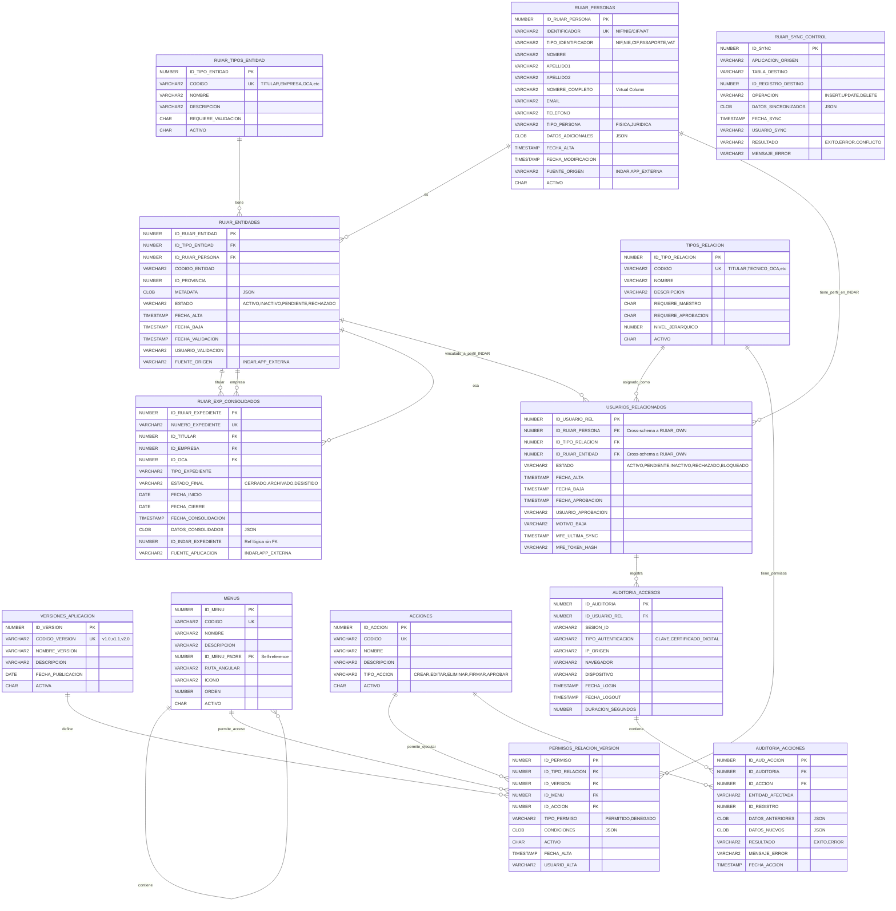

# 📊 DIAGRAMA UML - GESTIÓN DE USUARIOS INDAR/RUIAR

**Fecha:** 24 de Noviembre de 2025  
**Versión:** 2.0 - Integración RUIAR  
**Relacionado con:** PropuestaFinal_GestionUsuarios_INDAR_v2.md

---

## 🆕 CAMBIOS RESPECTO A VERSIÓN 1.0

Esta versión incluye:
- **Separación en 2 esquemas**: RUIAR_OWN (maestros) e INDAR_OWN (permisos)
- **Referencias cross-schema** entre esquemas
- **Nuevas tablas RUIAR**: RUIAR_EXP_CONSOLIDADOS, RUIAR_SYNC_CONTROL
- **Tablas movidas**: DATOS_PERSONALES, TIPOS_MAESTRO, MAESTROS_USUARIOS → RUIAR_OWN

---

## 🗂️ DIAGRAMA ENTIDAD-RELACIÓN

Este diagrama muestra las tablas organizadas por esquema con sus relaciones.



---

## 🔗 DESCRIPCIÓN DE RELACIONES

### **ESQUEMA RUIAR_OWN (Maestros Compartidos)**

| Relación | Cardinalidad | Descripción |
|----------|--------------|-------------|
| `RUIAR_TIPOS_ENTIDAD` → `RUIAR_ENTIDADES` | 1:N | Un tipo puede tener muchas entidades |
| `RUIAR_PERSONAS` → `RUIAR_ENTIDADES` | 1:N | Una persona puede ser varias entidades (titular, empresa) |
| `RUIAR_ENTIDADES` → `RUIAR_EXP_CONSOLIDADOS` | 1:N | Una entidad puede estar en múltiples expedientes |

**Ejemplo RUIAR:**
```
Juan López (RUIAR_PERSONAS)
├── Entidad: TITULAR individual (RUIAR_ENTIDADES)
└── Entidad: EMPRESA "Consultores López" (RUIAR_ENTIDADES)

Expediente EXP-2025-001 (RUIAR_EXP_CONSOLIDADOS)
├── Titular: Juan López
├── Empresa: Instalaciones Sur
└── OCA: OCA Aragón
```

---

### **RELACIONES CROSS-SCHEMA (RUIAR ← INDAR)**

| Relación | Cardinalidad | Tipo FK | Descripción |
|----------|--------------|---------|-------------|
| `RUIAR_PERSONAS` → `USUARIOS_RELACIONADOS` | 1:N | Cross-schema | Una persona puede tener múltiples perfiles en INDAR |
| `RUIAR_ENTIDADES` → `USUARIOS_RELACIONADOS` | 1:N | Cross-schema | Una entidad puede tener múltiples usuarios relacionados en INDAR |

**Ejemplo Cross-Schema:**
```
RUIAR_OWN.RUIAR_PERSONAS (ID_RUIAR_PERSONA=1)
    ↓ FK cross-schema
INDAR_OWN.USUARIOS_RELACIONADOS
    ├── Perfil: TITULAR (sin entidad)
    ├── Perfil: TECNICO_EMPRESA → vinculado a RUIAR_OWN.RUIAR_ENTIDADES(ID=5)
    └── Perfil: TECNICO_OCA → vinculado a RUIAR_OWN.RUIAR_ENTIDADES(ID=10)
```

---

### **ESQUEMA INDAR_OWN (Permisos y Operaciones)**

| Relación | Cardinalidad | Descripción |
|----------|--------------|-------------|
| `TIPOS_RELACION` → `USUARIOS_RELACIONADOS` | 1:N | Un perfil puede asignarse a muchos usuarios |
| `TIPOS_RELACION` → `PERMISOS_RELACION_VERSION` | 1:N | Un perfil tiene muchos permisos |
| `VERSIONES_APLICACION` → `PERMISOS_RELACION_VERSION` | 1:N | Una versión define muchos permisos |
| `MENUS` → `PERMISOS_RELACION_VERSION` | 1:N | Un menú puede tener permisos en varios perfiles |
| `ACCIONES` → `PERMISOS_RELACION_VERSION` | 1:N | Una acción puede permitirse en varios contextos |
| `USUARIOS_RELACIONADOS` → `AUDITORIA_ACCESOS` | 1:N | Un usuario registra múltiples accesos |
| `AUDITORIA_ACCESOS` → `AUDITORIA_ACCIONES` | 1:N | Un acceso contiene múltiples acciones |

**Lógica de permisos INDAR:**
```
PERMISO = PERFIL (TIPOS_RELACION) 
        + VERSIÓN (VERSIONES_APLICACION)
        + MENÚ (MENUS)
        + ACCIÓN (ACCIONES)
```

---

## 📋 CARDINALIDADES DETALLADAS

### **Tabla de Relaciones Completa:**

| Tabla Origen | Relación | Tabla Destino | Cardinalidad | Esquema | FK Type |
|--------------|----------|---------------|--------------|---------|---------|
| **RUIAR_OWN** | | | | | |
| RUIAR_TIPOS_ENTIDAD | tiene | RUIAR_ENTIDADES | 1:N | RUIAR | Local |
| RUIAR_PERSONAS | es | RUIAR_ENTIDADES | 1:N | RUIAR | Local |
| RUIAR_ENTIDADES | titular | RUIAR_EXP_CONSOLIDADOS | 1:N | RUIAR | Local |
| RUIAR_ENTIDADES | empresa | RUIAR_EXP_CONSOLIDADOS | 1:N | RUIAR | Local |
| RUIAR_ENTIDADES | oca | RUIAR_EXP_CONSOLIDADOS | 1:N | RUIAR | Local |
| **CROSS-SCHEMA** | | | | | |
| RUIAR_PERSONAS | tiene_perfil | USUARIOS_RELACIONADOS | 1:N | RUIAR→INDAR | **Cross-schema** |
| RUIAR_ENTIDADES | vinculado_a | USUARIOS_RELACIONADOS | 1:N | RUIAR→INDAR | **Cross-schema** |
| **INDAR_OWN** | | | | | |
| TIPOS_RELACION | asignado_como | USUARIOS_RELACIONADOS | 1:N | INDAR | Local |
| MENUS | contiene | MENUS | 1:N | INDAR | Self-ref |
| TIPOS_RELACION | tiene | PERMISOS_RELACION_VERSION | 1:N | INDAR | Local |
| VERSIONES_APLICACION | define | PERMISOS_RELACION_VERSION | 1:N | INDAR | Local |
| MENUS | permite_acceso | PERMISOS_RELACION_VERSION | 1:N | INDAR | Local |
| ACCIONES | permite_ejecutar | PERMISOS_RELACION_VERSION | 1:N | INDAR | Local |
| USUARIOS_RELACIONADOS | registra | AUDITORIA_ACCESOS | 1:N | INDAR | Local |
| AUDITORIA_ACCESOS | contiene | AUDITORIA_ACCIONES | 1:N | INDAR | Local |
| ACCIONES | registra | AUDITORIA_ACCIONES | 1:N | INDAR | Local |

---

## 🎯 ÍNDICES Y CONSTRAINTS

### **Claves Primarias (PK):**
- Todas las tablas usan `GENERATED ALWAYS AS IDENTITY`
- Secuencias automáticas sin caché (Oracle 12c+, compatible con 10g)

### **Claves Únicas (UK):**

**RUIAR_OWN:**
- `RUIAR_PERSONAS.IDENTIFICADOR`
- `RUIAR_TIPOS_ENTIDAD.CODIGO`
- `RUIAR_EXP_CONSOLIDADOS.NUMERO_EXPEDIENTE`

**INDAR_OWN:**
- `TIPOS_RELACION.CODIGO`
- `VERSIONES_APLICACION.CODIGO_VERSION`
- `MENUS.CODIGO`
- `ACCIONES.CODIGO`
- `USUARIOS_RELACIONADOS(ID_RUIAR_PERSONA, ID_TIPO_RELACION, COALESCE(ID_RUIAR_ENTIDAD,-1))`
- `PERMISOS_RELACION_VERSION(ID_TIPO_RELACION, ID_VERSION, ID_MENU, ID_ACCION)`

### **Índices por Esquema:**

```sql
-- RUIAR_OWN
IDX_RPER_IDENTIFICADOR ON RUIAR_PERSONAS(IDENTIFICADOR)
IDX_RENT_TIPO ON RUIAR_ENTIDADES(ID_TIPO_ENTIDAD)
IDX_RENT_PERSONA ON RUIAR_ENTIDADES(ID_RUIAR_PERSONA)
IDX_REXP_TITULAR ON RUIAR_EXP_CONSOLIDADOS(ID_TITULAR)
IDX_RSYNC_APP ON RUIAR_SYNC_CONTROL(APLICACION_ORIGEN)

-- INDAR_OWN
IDX_USUREL_PERSONA ON USUARIOS_RELACIONADOS(ID_RUIAR_PERSONA) -- Cross-schema
IDX_USUREL_ENTIDAD ON USUARIOS_RELACIONADOS(ID_RUIAR_ENTIDAD) -- Cross-schema
IDX_PERM_TIPO ON PERMISOS_RELACION_VERSION(ID_TIPO_RELACION)
IDX_AUD_USUARIO ON AUDITORIA_ACCESOS(ID_USUARIO_REL)
```

---

## 🔍 CONSULTAS TIPO

### **1. Obtener perfiles de un usuario (Cross-Schema):**

```sql
SELECT 
    rp.NOMBRE_COMPLETO,
    tr.NOMBRE AS PERFIL,
    re.CODIGO_ENTIDAD AS ENTIDAD,
    ur.ESTADO
FROM RUIAR_OWN.RUIAR_PERSONAS rp
JOIN INDAR_OWN.USUARIOS_RELACIONADOS ur ON rp.ID_RUIAR_PERSONA = ur.ID_RUIAR_PERSONA
JOIN INDAR_OWN.TIPOS_RELACION tr ON ur.ID_TIPO_RELACION = tr.ID_TIPO_RELACION
LEFT JOIN RUIAR_OWN.RUIAR_ENTIDADES re ON ur.ID_RUIAR_ENTIDAD = re.ID_RUIAR_ENTIDAD
WHERE rp.IDENTIFICADOR = '12345678Z'
  AND ur.ESTADO = 'ACTIVO';
```

### **2. Consultar expedientes consolidados en RUIAR:**

```sql
SELECT 
    rec.NUMERO_EXPEDIENTE,
    rp_tit.NOMBRE_COMPLETO AS TITULAR,
    rp_emp.NOMBRE_COMPLETO AS EMPRESA,
    rp_oca.NOMBRE_COMPLETO AS OCA,
    rec.ESTADO_FINAL,
    rec.FECHA_CIERRE,
    rec.FUENTE_APLICACION
FROM RUIAR_OWN.RUIAR_EXP_CONSOLIDADOS rec
JOIN RUIAR_OWN.RUIAR_ENTIDADES re_tit ON rec.ID_TITULAR = re_tit.ID_RUIAR_ENTIDAD
JOIN RUIAR_OWN.RUIAR_PERSONAS rp_tit ON re_tit.ID_RUIAR_PERSONA = rp_tit.ID_RUIAR_PERSONA
LEFT JOIN RUIAR_OWN.RUIAR_ENTIDADES re_emp ON rec.ID_EMPRESA = re_emp.ID_RUIAR_ENTIDAD
LEFT JOIN RUIAR_OWN.RUIAR_PERSONAS rp_emp ON re_emp.ID_RUIAR_PERSONA = rp_emp.ID_RUIAR_PERSONA
LEFT JOIN RUIAR_OWN.RUIAR_ENTIDADES re_oca ON rec.ID_OCA = re_oca.ID_RUIAR_ENTIDAD
LEFT JOIN RUIAR_OWN.RUIAR_PERSONAS rp_oca ON re_oca.ID_RUIAR_PERSONA = rp_oca.ID_RUIAR_PERSONA
WHERE rec.ESTADO_FINAL = 'CERRADO'
  AND rec.FECHA_CIERRE >= ADD_MONTHS(SYSDATE, -12);
```

### **3. Auditoría de sincronizaciones:**

```sql
SELECT 
    rsc.APLICACION_ORIGEN,
    rsc.TABLA_DESTINO,
    COUNT(*) AS TOTAL_SINCRONIZACIONES,
    SUM(CASE WHEN rsc.RESULTADO = 'EXITO' THEN 1 ELSE 0 END) AS EXITOSAS,
    SUM(CASE WHEN rsc.RESULTADO = 'ERROR' THEN 1 ELSE 0 END) AS ERRORES,
    MAX(rsc.FECHA_SYNC) AS ULTIMA_SINCRONIZACION
FROM RUIAR_OWN.RUIAR_SYNC_CONTROL rsc
WHERE rsc.FECHA_SYNC >= TRUNC(SYSDATE) - 7
GROUP BY rsc.APLICACION_ORIGEN, rsc.TABLA_DESTINO
ORDER BY rsc.APLICACION_ORIGEN, rsc.TABLA_DESTINO;
```

---

## 💡 CARACTERÍSTICAS DEL MODELO v2.0

### ✅ **Ventajas:**

1. **Separación de responsabilidades**: RUIAR (maestros) vs INDAR (permisos)
2. **Registro único**: RUIAR como fuente única de verdad para entidades
3. **Multi-aplicación**: RUIAR accesible desde múltiples sistemas
4. **Referencias controladas**: Foreign Keys cross-schema mantienen integridad
5. **Autonomía**: RUIAR independiente de INDAR
6. **Escalabilidad**: Nuevas apps se integran fácilmente
7. **Auditoría multi-fuente**: RUIAR_SYNC_CONTROL rastrea origen de datos
8. **Compatibilidad**: Vistas en INDAR mantienen código existente funcionando

### ⚠️ **Consideraciones:**

1. **Foreign Keys cross-schema**: Requieren permisos entre esquemas
2. **Rendimiento**: Consultas cross-schema pueden ser más lentas (usar índices)
3. **Mantenimiento**: Dos esquemas requieren coordinación en cambios estructurales
4. **Sincronización**: Procedimientos ETL críticos para mantener RUIAR actualizado
5. **Versionado**: Cambios en RUIAR pueden afectar múltiples aplicaciones

---

## 📊 COMPARATIVA v1.0 vs v2.0

| Aspecto | v1.0 (Un esquema) | v2.0 (Dos esquemas) |
|---------|-------------------|---------------------|
| **Esquemas** | 1 (INDAR_OWN) | 2 (RUIAR_OWN + INDAR_OWN) |
| **Personas** | DATOS_PERSONALES | RUIAR_PERSONAS |
| **Entidades** | MAESTROS_USUARIOS | RUIAR_ENTIDADES |
| **Acceso externo** | ❌ Solo INDAR | ✅ RUIAR multi-app |
| **Duplicación datos** | ❌ No necesaria | ❌ Evitada con refs |
| **Complejidad** | ⭐⭐ Baja | ⭐⭐⭐ Media |
| **Escalabilidad** | ⭐⭐ Limitada | ⭐⭐⭐⭐⭐ Alta |
| **Independencia** | ❌ Acoplado | ✅ Desacoplado |

---

## 🔄 FLUJO DE DATOS

```
┌─────────────────────────────────────────────┐
│ Usuario accede a INDAR                       │
│ (Cl@ve / Certificado Digital MFE)           │
└──────────────────┬──────────────────────────┘
                   │
                   ▼
┌─────────────────────────────────────────────┐
│ 1. INDAR consulta RUIAR_PERSONAS            │
│    (autenticación usuario)                   │
└──────────────────┬──────────────────────────┘
                   │
                   ▼
┌─────────────────────────────────────────────┐
│ 2. INDAR crea USUARIOS_RELACIONADOS         │
│    (asigna perfiles)                         │
└──────────────────┬──────────────────────────┘
                   │
                   ▼
┌─────────────────────────────────────────────┐
│ 3. Usuario opera en expedientes (INDAR)     │
│    (flujo completo con histórico)            │
└──────────────────┬──────────────────────────┘
                   │
                   ▼
┌─────────────────────────────────────────────┐
│ 4. Expediente se cierra                      │
│    → Trigger SYNC_EXPEDIENTE_A_RUIAR        │
└──────────────────┬──────────────────────────┘
                   │
                   ▼
┌─────────────────────────────────────────────┐
│ 5. RUIAR_EXP_CONSOLIDADOS recibe foto final │
│    (sin histórico, solo estado final)        │
└──────────────────┬──────────────────────────┘
                   │
                   ▼
┌─────────────────────────────────────────────┐
│ 6. Apps externas consultan RUIAR            │
│    (acceso a expedientes consolidados)       │
└─────────────────────────────────────────────┘
```

---

## 📚 REFERENCIAS

- **Propuesta v2.0:** PropuestaFinal_GestionUsuarios_INDAR_v2.md
- **Propuesta v1.0:** PropuestaFinal_GestionUsuarios_INDAR.md
- **Diagrama v1.0:** DiagramaUML_GestionUsuarios_INDAR.md
- **Estándar UML:** https://www.uml-diagrams.org/
- **Mermaid Docs:** https://mermaid.js.org/syntax/entityRelationshipDiagram.html
- **Oracle Cross-Schema:** https://docs.oracle.com/en/database/oracle/oracle-database/19/sqlrf/constraint.html
- **Oracle JSON:** https://docs.oracle.com/en/database/oracle/oracle-database/19/adjsn/

---

**Generado por:** GitHub Copilot  
**Fecha:** 24 de Noviembre de 2025  
**Versión:** 2.0 con RUIAR
