# 🎯 PROPUESTA: MODELADO DE AGENTES SIN DUPLICIDAD + VERSIONADO + FOTO FIJA POR EXPEDIENTE

**Autor:** GitHub Copilot  
**Fecha:** Febrero 2026  
**Versión:** 1.0  
**Contexto técnico:** Oracle 10g · Sin IDENTITY · Nombres ≤ 30 caracteres · Sequences NOCACHE · Auditoría por triggers

---

## 📋 ÍNDICE

1. [Objetivo](#objetivo)
2. [Principios de Diseño](#principios-de-diseño)
3. [Modelo de Datos (UML Mermaid)](#modelo-de-datos)
4. [Detalle de Tablas y DDL](#detalle-de-tablas-y-ddl)
5. [Sequences y Triggers de Auditoría](#sequences-y-triggers-de-auditoría)
6. [Reglas de Negocio](#reglas-de-negocio)
7. [Ejemplos Prácticos](#ejemplos-prácticos)
8. [Consultas de Referencia](#consultas-de-referencia)

---

## 1. Objetivo

Definir un modelo de base de datos para la gestión de **agentes** (personas físicas y jurídicas) que garantice:

- **Agente único** por NIF/CIF/NIE: un solo registro de identidad por número de documento, sin duplicados.
- **Versionado de datos (SCD Tipo 2)**: cada cambio en los datos de un agente genera una nueva versión, conservando el histórico completo.
- **Histórico de documentos identificativos**: trazabilidad de los documentos CIF/NIF presentados por un agente a lo largo del tiempo.
- **Foto fija por expediente**: cada expediente queda vinculado a una versión concreta del agente en el momento de su tramitación, de modo que los cambios posteriores no alteran la vista histórica del expediente.

---

## 2. Principios de Diseño

| # | Principio | Descripción |
|---|-----------|-------------|
| 1 | **Identidad única** | La tabla `AG_AGENTE` actúa como maestro de identidad. Un agente existe una sola vez, identificado por tipo + número de documento. |
| 2 | **SCD Tipo 2 en datos** | La tabla `AG_AGENTE_VERSION` almacena todas las versiones de datos. Solo una versión puede estar activa (`FLG_ACTIVO = 'S'`). |
| 3 | **Histórico de documentos** | La tabla `AG_DOCUMENTO` registra cada documento presentado con sus fechas de vigencia. |
| 4 | **Foto fija (snapshot)** | La tabla `EXP_AGENTE_VERSION` vincula cada expediente a la versión de agente vigente en el momento de la tramitación. |
| 5 | **Oracle 10g compatible** | Sin `GENERATED ALWAYS AS IDENTITY`. Se utilizan `SEQUENCE` + trigger `BEFORE INSERT` para las PKs. Nombres de columna y tabla ≤ 30 caracteres. Sequences con `NOCACHE`. |
| 6 | **Auditoría por triggers** | Los campos `FEC_CREACION`, `USR_CREACION`, `FEC_MODIF`, `USR_MODIF` se rellenan mediante triggers, sin depender de la capa de aplicación. |

---

## 3. Modelo de Datos

### 3.1 Diagrama Entidad-Relación


### 3.2 Diagrama de Flujo: Gestión de Cambio de Datos de un Agente

```mermaid
flowchart TD
    A([Solicitud de cambio de datos]) --> B{¿Existe el agente\npor NIF/CIF?}
    B -- No --> C[Crear AG_AGENTE\n+ primera AG_AGENTE_VERSION]
    B -- Sí --> D[Localizar versión activa\nFLG_ACTIVO = 'S']
    D --> E[Cerrar versión activa\nFEC_FIN_VIGENCIA = SYSDATE\nFLG_ACTIVO = 'N']
    E --> F[Crear nueva AG_AGENTE_VERSION\nNUM_VERSION + 1\nFEC_INI_VIGENCIA = SYSDATE\nFLG_ACTIVO = 'S']
    F --> G[Registrar MOTIVO_CAMBIO]
    C --> H([Fin])
    G --> H
```



### 3.3 Diagrama de Flujo: Foto Fija al Asignar Agente a Expediente

```mermaid
flowchart TD
    A([Asignar agente a expediente]) --> B[Obtener versión activa\ndel agente\nAG_AGENTE_VERSION donde\nFLG_ACTIVO = 'S']
    B --> C[Insertar en EXP_AGENTE_VERSION\ncon ID_AGENTE_VER de la versión activa]
    C --> D([Foto fija guardada])
    D --> E{¿El agente cambia\nsus datos después?}
    E -- Sí --> F[Se crea nueva versión\nen AG_AGENTE_VERSION]
    F --> G[EXP_AGENTE_VERSION\nNO se modifica\nsigue apuntando a la versión antigua]
    G --> H([Integridad histórica preservada])
    E -- No --> H
```



---

## 4. Detalle de Tablas y DDL

### 4.1 AG_AGENTE — Maestro de Identidad

Registro único por agente. La unicidad se garantiza mediante el índice único `(TIPO_DOCUMENTO, NUM_DOCUMENTO)`.

```sql
CREATE TABLE AG_AGENTE (
    ID_AGENTE        NUMBER(10)    NOT NULL,
    TIPO_DOCUMENTO   VARCHAR2(20)  NOT NULL,
    NUM_DOCUMENTO    VARCHAR2(20)  NOT NULL,
    TIPO_AGENTE      VARCHAR2(20)  NOT NULL,
    FLG_ACTIVO       CHAR(1)       DEFAULT 'S' NOT NULL,
    FEC_CREACION     DATE          DEFAULT SYSDATE NOT NULL,
    USR_CREACION     VARCHAR2(50)  NOT NULL,
    FEC_MODIF        DATE,
    USR_MODIF        VARCHAR2(50),
    CONSTRAINT PK_AG_AGENTE PRIMARY KEY (ID_AGENTE),
    CONSTRAINT UQ_AG_AGENTE_DOC UNIQUE (TIPO_DOCUMENTO, NUM_DOCUMENTO),
    CONSTRAINT CK_AG_AGENTE_TIPO_DOC CHECK (
        TIPO_DOCUMENTO IN ('NIF','NIE','CIF','PASAPORTE','VAT')
    ),
    CONSTRAINT CK_AG_AGENTE_TIPO CHECK (
        TIPO_AGENTE IN ('FISICA','JURIDICA')
    ),
    CONSTRAINT CK_AG_AGENTE_ACTIVO CHECK (
        FLG_ACTIVO IN ('S','N')
    )
);

COMMENT ON TABLE  AG_AGENTE                IS 'Maestro de identidad de agentes. Un registro por NIF/CIF/NIE.';
COMMENT ON COLUMN AG_AGENTE.ID_AGENTE      IS 'PK. Generada por SEQ_AG_AGENTE + trigger.';
COMMENT ON COLUMN AG_AGENTE.TIPO_DOCUMENTO IS 'Tipo de documento: NIF, NIE, CIF, PASAPORTE, VAT.';
COMMENT ON COLUMN AG_AGENTE.NUM_DOCUMENTO  IS 'Número de documento identificativo. Único junto con TIPO_DOCUMENTO.';
COMMENT ON COLUMN AG_AGENTE.TIPO_AGENTE    IS 'FISICA = persona física. JURIDICA = persona jurídica / empresa.';
COMMENT ON COLUMN AG_AGENTE.FLG_ACTIVO     IS 'S = agente activo. N = agente dado de baja lógica.';
```

---

### 4.2 AG_AGENTE_VERSION — Versionado SCD Tipo 2

Cada fila representa una versión de los datos de un agente. Solo una versión puede tener `FLG_ACTIVO = 'S'` para el mismo `ID_AGENTE` (garantizado por índice único parcial implementado mediante constraint funcional en Oracle 10g).

```sql
CREATE TABLE AG_AGENTE_VERSION (
    ID_AGENTE_VER    NUMBER(10)    NOT NULL,
    ID_AGENTE        NUMBER(10)    NOT NULL,
    NUM_VERSION      NUMBER(5)     DEFAULT 1 NOT NULL,
    NOMBRE_RAZON_SOC VARCHAR2(200) NOT NULL,
    APELLIDO1        VARCHAR2(100),
    APELLIDO2        VARCHAR2(100),
    EMAIL            VARCHAR2(200),
    TELEFONO         VARCHAR2(30),
    DIRECCION        VARCHAR2(500),
    FLG_ACTIVO       CHAR(1)       DEFAULT 'S' NOT NULL,
    FEC_INI_VIGENCIA DATE          DEFAULT SYSDATE NOT NULL,
    FEC_FIN_VIGENCIA DATE,
    MOTIVO_CAMBIO    VARCHAR2(500),
    FEC_CREACION     DATE          DEFAULT SYSDATE NOT NULL,
    USR_CREACION     VARCHAR2(50)  NOT NULL,
    CONSTRAINT PK_AG_AGENTE_VER PRIMARY KEY (ID_AGENTE_VER),
    CONSTRAINT FK_AGV_AGENTE FOREIGN KEY (ID_AGENTE)
        REFERENCES AG_AGENTE (ID_AGENTE),
    CONSTRAINT CK_AGV_ACTIVO CHECK (
        FLG_ACTIVO IN ('S','N')
    ),
    CONSTRAINT CK_AGV_VIGENCIA CHECK (
        FEC_FIN_VIGENCIA IS NULL OR FEC_FIN_VIGENCIA >= FEC_INI_VIGENCIA
    )
);

-- Índice para localizar la versión activa de forma eficiente
CREATE INDEX IDX_AGV_AGENTE_ACTIVO
    ON AG_AGENTE_VERSION (ID_AGENTE, FLG_ACTIVO);

-- Índice para navegación histórica por agente y versión
CREATE INDEX IDX_AGV_AGENTE_VER
    ON AG_AGENTE_VERSION (ID_AGENTE, NUM_VERSION);

COMMENT ON TABLE  AG_AGENTE_VERSION              IS 'Versiones SCD2 de datos de agente. Solo FLG_ACTIVO=S es la versión vigente.';
COMMENT ON COLUMN AG_AGENTE_VERSION.ID_AGENTE_VER IS 'PK. Generada por SEQ_AG_AGENTE_VER + trigger.';
COMMENT ON COLUMN AG_AGENTE_VERSION.NUM_VERSION   IS 'Número de versión correlativo por agente. Empieza en 1.';
COMMENT ON COLUMN AG_AGENTE_VERSION.FLG_ACTIVO    IS 'S = versión vigente. N = versión histórica cerrada.';
COMMENT ON COLUMN AG_AGENTE_VERSION.FEC_INI_VIGENCIA IS 'Fecha de inicio de validez de esta versión.';
COMMENT ON COLUMN AG_AGENTE_VERSION.FEC_FIN_VIGENCIA IS 'Fecha de fin de validez. NULL si es la versión activa.';
COMMENT ON COLUMN AG_AGENTE_VERSION.MOTIVO_CAMBIO IS 'Descripción del motivo que originó esta nueva versión.';
```

---

### 4.3 AG_DOCUMENTO — Histórico de Documentos

Registra cada documento CIF/NIF presentado por un agente, permitiendo rastrear cambios de número (p.ej. cambio de CIF a NIF tras transformación societaria).

```sql
CREATE TABLE AG_DOCUMENTO (
    ID_DOCUMENTO     NUMBER(10)    NOT NULL,
    ID_AGENTE        NUMBER(10)    NOT NULL,
    TIPO_DOCUMENTO   VARCHAR2(20)  NOT NULL,
    NUM_DOCUMENTO    VARCHAR2(20)  NOT NULL,
    FEC_EMISION      DATE,
    FEC_CADUCIDAD    DATE,
    FEC_REGISTRO     DATE          DEFAULT SYSDATE NOT NULL,
    FEC_BAJA         DATE,
    OBS_DOCUMENTO    VARCHAR2(200),
    FEC_CREACION     DATE          DEFAULT SYSDATE NOT NULL,
    USR_CREACION     VARCHAR2(50)  NOT NULL,
    CONSTRAINT PK_AG_DOCUMENTO PRIMARY KEY (ID_DOCUMENTO),
    CONSTRAINT FK_AGDOC_AGENTE FOREIGN KEY (ID_AGENTE)
        REFERENCES AG_AGENTE (ID_AGENTE),
    CONSTRAINT CK_AGDOC_TIPO CHECK (
        TIPO_DOCUMENTO IN ('NIF','NIE','CIF','PASAPORTE','VAT')
    ),
    CONSTRAINT CK_AGDOC_CADUCIDAD CHECK (
        FEC_CADUCIDAD IS NULL OR FEC_CADUCIDAD >= FEC_EMISION
    )
);

CREATE INDEX IDX_AGDOC_AGENTE
    ON AG_DOCUMENTO (ID_AGENTE, FEC_REGISTRO DESC);

COMMENT ON TABLE  AG_DOCUMENTO               IS 'Histórico de documentos identificativos presentados por el agente.';
COMMENT ON COLUMN AG_DOCUMENTO.ID_DOCUMENTO  IS 'PK. Generada por SEQ_AG_DOCUMENTO + trigger.';
COMMENT ON COLUMN AG_DOCUMENTO.FEC_BAJA      IS 'NULL = documento vigente. Fecha = documento sustituido o caducado.';
```

---

### 4.4 EXPEDIENTE — Tabla de Expedientes

```sql
CREATE TABLE EXPEDIENTE (
    ID_EXPEDIENTE    NUMBER(10)    NOT NULL,
    NUM_EXPEDIENTE   VARCHAR2(50)  NOT NULL,
    DESCRIPCION      VARCHAR2(200),
    ESTADO           VARCHAR2(30)  DEFAULT 'ABIERTO' NOT NULL,
    FEC_INICIO       DATE          DEFAULT SYSDATE NOT NULL,
    FEC_CIERRE       DATE,
    FEC_CREACION     DATE          DEFAULT SYSDATE NOT NULL,
    USR_CREACION     VARCHAR2(50)  NOT NULL,
    FEC_MODIF        DATE,
    USR_MODIF        VARCHAR2(50),
    CONSTRAINT PK_EXPEDIENTE PRIMARY KEY (ID_EXPEDIENTE),
    CONSTRAINT UQ_EXP_NUM UNIQUE (NUM_EXPEDIENTE),
    CONSTRAINT CK_EXP_ESTADO CHECK (
        ESTADO IN ('ABIERTO','EN_TRAMITE','CERRADO','ARCHIVADO','DESISTIDO')
    ),
    CONSTRAINT CK_EXP_CIERRE CHECK (
        FEC_CIERRE IS NULL OR FEC_CIERRE >= FEC_INICIO
    )
);

COMMENT ON TABLE  EXPEDIENTE                IS 'Expedientes administrativos gestionados en el sistema.';
COMMENT ON COLUMN EXPEDIENTE.ID_EXPEDIENTE  IS 'PK. Generada por SEQ_EXPEDIENTE + trigger.';
COMMENT ON COLUMN EXPEDIENTE.NUM_EXPEDIENTE IS 'Número de expediente. Único e inmutable una vez asignado.';
```

---

### 4.5 EXP_AGENTE_VERSION — Foto Fija Expediente-Agente

Esta tabla es el pilar del concepto de **foto fija**: vincula un expediente a la versión concreta del agente que estaba vigente en el momento de su participación. Aunque los datos del agente cambien posteriormente, el expediente conserva la referencia histórica.

```sql
CREATE TABLE EXP_AGENTE_VERSION (
    ID_EXP_AG_VER    NUMBER(10)    NOT NULL,
    ID_EXPEDIENTE    NUMBER(10)    NOT NULL,
    ID_AGENTE        NUMBER(10)    NOT NULL,
    ID_AGENTE_VER    NUMBER(10)    NOT NULL,
    ROL_AGENTE       VARCHAR2(30)  NOT NULL,
    FEC_ASIGNACION   DATE          DEFAULT SYSDATE NOT NULL,
    FEC_BAJA         DATE,
    FEC_CREACION     DATE          DEFAULT SYSDATE NOT NULL,
    USR_CREACION     VARCHAR2(50)  NOT NULL,
    CONSTRAINT PK_EXP_AGENTE_VER PRIMARY KEY (ID_EXP_AG_VER),
    CONSTRAINT FK_EAV_EXPEDIENTE FOREIGN KEY (ID_EXPEDIENTE)
        REFERENCES EXPEDIENTE (ID_EXPEDIENTE),
    CONSTRAINT FK_EAV_AGENTE FOREIGN KEY (ID_AGENTE)
        REFERENCES AG_AGENTE (ID_AGENTE),
    CONSTRAINT FK_EAV_AGENTE_VER FOREIGN KEY (ID_AGENTE_VER)
        REFERENCES AG_AGENTE_VERSION (ID_AGENTE_VER),
    CONSTRAINT CK_EAV_ROL CHECK (
        ROL_AGENTE IN (
            'TITULAR','REPRESENTANTE','EMPRESA',
            'OCA','TECNICO','TRAMITADOR'
        )
    )
);

CREATE UNIQUE INDEX UQ_EAV_EXP_AGENTE_ROL
    ON EXP_AGENTE_VERSION (ID_EXPEDIENTE, ID_AGENTE, ROL_AGENTE);

CREATE INDEX IDX_EAV_EXPEDIENTE
    ON EXP_AGENTE_VERSION (ID_EXPEDIENTE);

CREATE INDEX IDX_EAV_AGENTE
    ON EXP_AGENTE_VERSION (ID_AGENTE);

CREATE INDEX IDX_EAV_AGENTE_VER
    ON EXP_AGENTE_VERSION (ID_AGENTE_VER);

COMMENT ON TABLE  EXP_AGENTE_VERSION              IS 'Foto fija: vincula expediente a la version del agente en el momento de asignacion.';
COMMENT ON COLUMN EXP_AGENTE_VERSION.ID_AGENTE_VER IS 'FK a AG_AGENTE_VERSION. No cambia aunque el agente actualice sus datos.';
COMMENT ON COLUMN EXP_AGENTE_VERSION.ROL_AGENTE    IS 'Rol del agente en el expediente: TITULAR, REPRESENTANTE, EMPRESA, OCA, etc.';
COMMENT ON COLUMN EXP_AGENTE_VERSION.FEC_BAJA      IS 'NULL = participacion activa. Fecha = agente desvinculado del expediente.';
```

---

## 5. Sequences y Triggers de Auditoría

### 5.1 Sequences (NOCACHE para Oracle 10g)

```sql
CREATE SEQUENCE SEQ_AG_AGENTE
    START WITH 1
    INCREMENT BY 1
    NOCACHE
    NOCYCLE;

CREATE SEQUENCE SEQ_AG_AGENTE_VER
    START WITH 1
    INCREMENT BY 1
    NOCACHE
    NOCYCLE;

CREATE SEQUENCE SEQ_AG_DOCUMENTO
    START WITH 1
    INCREMENT BY 1
    NOCACHE
    NOCYCLE;

CREATE SEQUENCE SEQ_EXPEDIENTE
    START WITH 1
    INCREMENT BY 1
    NOCACHE
    NOCYCLE;

CREATE SEQUENCE SEQ_EXP_AGENTE_VER
    START WITH 1
    INCREMENT BY 1
    NOCACHE
    NOCYCLE;
```

### 5.2 Triggers de PK y Auditoría

#### AG_AGENTE

```sql
CREATE OR REPLACE TRIGGER TRG_AG_AGENTE_BI
    BEFORE INSERT ON AG_AGENTE
    FOR EACH ROW
BEGIN
    IF :NEW.ID_AGENTE IS NULL THEN
        SELECT SEQ_AG_AGENTE.NEXTVAL
        INTO   :NEW.ID_AGENTE
        FROM   DUAL;
    END IF;
    :NEW.FEC_CREACION := SYSDATE;
    :NEW.USR_CREACION := NVL(SYS_CONTEXT('USERENV','SESSION_USER'), USER);
END TRG_AG_AGENTE_BI;
/

CREATE OR REPLACE TRIGGER TRG_AG_AGENTE_BU
    BEFORE UPDATE ON AG_AGENTE
    FOR EACH ROW
BEGIN
    :NEW.FEC_MODIF := SYSDATE;
    :NEW.USR_MODIF := NVL(SYS_CONTEXT('USERENV','SESSION_USER'), USER);
    -- Proteger la identidad: no se permite cambiar el documento identificativo
    IF :NEW.TIPO_DOCUMENTO != :OLD.TIPO_DOCUMENTO
       OR :NEW.NUM_DOCUMENTO  != :OLD.NUM_DOCUMENTO THEN
        RAISE_APPLICATION_ERROR(
            -20001,
            'No se permite modificar el documento identificativo de un agente. '
            || 'Use el historico AG_DOCUMENTO para registrar cambios de documento.'
        );
    END IF;
END TRG_AG_AGENTE_BU;
/
```

#### AG_AGENTE_VERSION

```sql
CREATE OR REPLACE TRIGGER TRG_AG_AGENTE_VER_BI
    BEFORE INSERT ON AG_AGENTE_VERSION
    FOR EACH ROW
DECLARE
    v_max_ver NUMBER(5);
BEGIN
    IF :NEW.ID_AGENTE_VER IS NULL THEN
        SELECT SEQ_AG_AGENTE_VER.NEXTVAL
        INTO   :NEW.ID_AGENTE_VER
        FROM   DUAL;
    END IF;
    -- Calcular automáticamente el número de versión siguiente
    IF :NEW.NUM_VERSION IS NULL OR :NEW.NUM_VERSION = 1 THEN
        SELECT NVL(MAX(NUM_VERSION), 0) + 1
        INTO   v_max_ver
        FROM   AG_AGENTE_VERSION
        WHERE  ID_AGENTE = :NEW.ID_AGENTE;
        :NEW.NUM_VERSION := v_max_ver;
    END IF;
    :NEW.FEC_CREACION := SYSDATE;
    :NEW.USR_CREACION := NVL(SYS_CONTEXT('USERENV','SESSION_USER'), USER);
END TRG_AG_AGENTE_VER_BI;
/
```

#### AG_DOCUMENTO

```sql
CREATE OR REPLACE TRIGGER TRG_AG_DOCUMENTO_BI
    BEFORE INSERT ON AG_DOCUMENTO
    FOR EACH ROW
BEGIN
    IF :NEW.ID_DOCUMENTO IS NULL THEN
        SELECT SEQ_AG_DOCUMENTO.NEXTVAL
        INTO   :NEW.ID_DOCUMENTO
        FROM   DUAL;
    END IF;
    :NEW.FEC_CREACION := SYSDATE;
    :NEW.USR_CREACION := NVL(SYS_CONTEXT('USERENV','SESSION_USER'), USER);
END TRG_AG_DOCUMENTO_BI;
/
```

#### EXPEDIENTE

```sql
CREATE OR REPLACE TRIGGER TRG_EXPEDIENTE_BI
    BEFORE INSERT ON EXPEDIENTE
    FOR EACH ROW
BEGIN
    IF :NEW.ID_EXPEDIENTE IS NULL THEN
        SELECT SEQ_EXPEDIENTE.NEXTVAL
        INTO   :NEW.ID_EXPEDIENTE
        FROM   DUAL;
    END IF;
    :NEW.FEC_CREACION := SYSDATE;
    :NEW.USR_CREACION := NVL(SYS_CONTEXT('USERENV','SESSION_USER'), USER);
END TRG_EXPEDIENTE_BI;
/

CREATE OR REPLACE TRIGGER TRG_EXPEDIENTE_BU
    BEFORE UPDATE ON EXPEDIENTE
    FOR EACH ROW
BEGIN
    :NEW.FEC_MODIF := SYSDATE;
    :NEW.USR_MODIF := NVL(SYS_CONTEXT('USERENV','SESSION_USER'), USER);
    -- Número de expediente inmutable
    IF :NEW.NUM_EXPEDIENTE != :OLD.NUM_EXPEDIENTE THEN
        RAISE_APPLICATION_ERROR(
            -20002,
            'El numero de expediente es inmutable una vez asignado.'
        );
    END IF;
END TRG_EXPEDIENTE_BU;
/
```

#### EXP_AGENTE_VERSION

```sql
CREATE OR REPLACE TRIGGER TRG_EXP_AGENTE_VER_BI
    BEFORE INSERT ON EXP_AGENTE_VERSION
    FOR EACH ROW
BEGIN
    IF :NEW.ID_EXP_AG_VER IS NULL THEN
        SELECT SEQ_EXP_AGENTE_VER.NEXTVAL
        INTO   :NEW.ID_EXP_AG_VER
        FROM   DUAL;
    END IF;
    :NEW.FEC_CREACION := SYSDATE;
    :NEW.USR_CREACION := NVL(SYS_CONTEXT('USERENV','SESSION_USER'), USER);
END TRG_EXP_AGENTE_VER_BI;
/
```

---

## 6. Reglas de Negocio

### Regla 1 — No duplicidad de agentes

> Un agente existe **una sola vez** en `AG_AGENTE`, identificado por `(TIPO_DOCUMENTO, NUM_DOCUMENTO)`.  
> Antes de crear un agente se debe comprobar si ya existe:

```sql
-- Comprobación previa a INSERT
SELECT ID_AGENTE
FROM   AG_AGENTE
WHERE  TIPO_DOCUMENTO = :tipo
  AND  NUM_DOCUMENTO  = :numero;
```

Si existe, **no** se crea un nuevo `AG_AGENTE`; se crea una nueva versión en `AG_AGENTE_VERSION`.

---

### Regla 2 — Solo una versión activa por agente

> En `AG_AGENTE_VERSION`, para un mismo `ID_AGENTE` solo puede haber una fila con `FLG_ACTIVO = 'S'`.  
> Al activar una nueva versión, se debe desactivar la anterior:

```sql
-- Paso 1: cerrar versión activa anterior
UPDATE AG_AGENTE_VERSION
SET    FLG_ACTIVO       = 'N',
       FEC_FIN_VIGENCIA = SYSDATE
WHERE  ID_AGENTE  = :id_agente
  AND  FLG_ACTIVO = 'S';

-- Paso 2: insertar nueva versión (el trigger asigna NUM_VERSION automáticamente)
INSERT INTO AG_AGENTE_VERSION (
    ID_AGENTE, NOMBRE_RAZON_SOC, APELLIDO1, APELLIDO2,
    EMAIL, TELEFONO, DIRECCION,
    FLG_ACTIVO, FEC_INI_VIGENCIA, MOTIVO_CAMBIO, USR_CREACION
) VALUES (
    :id_agente, :nombre, :apellido1, :apellido2,
    :email, :telefono, :direccion,
    'S', SYSDATE, :motivo, :usuario
);
```

---

### Regla 3 — Foto fija al asignar agente a expediente

> Al vincular un agente a un expediente, se debe capturar la versión activa en ese momento:

```sql
-- Obtener la versión activa
SELECT ID_AGENTE_VER
INTO   :v_id_ver
FROM   AG_AGENTE_VERSION
WHERE  ID_AGENTE  = :id_agente
  AND  FLG_ACTIVO = 'S';

-- Registrar la foto fija
INSERT INTO EXP_AGENTE_VERSION (
    ID_EXPEDIENTE, ID_AGENTE, ID_AGENTE_VER,
    ROL_AGENTE, FEC_ASIGNACION, USR_CREACION
) VALUES (
    :id_expediente, :id_agente, :v_id_ver,
    :rol, SYSDATE, :usuario
);
```

---

### Regla 4 — Inmutabilidad del documento identificativo

> El campo `NUM_DOCUMENTO` de `AG_AGENTE` es **inmutable**.  
> Si un agente cambia de documento (p.ej. empresa que pasa de CIF a NIF), el flujo correcto es:
>
> 1. Dar de baja lógica el agente antiguo (`FLG_ACTIVO = 'N'`).
> 2. Crear un nuevo `AG_AGENTE` con el nuevo documento.
> 3. Registrar ambos documentos en `AG_DOCUMENTO` para el agente nuevo con `OBS_DOCUMENTO` que relacione el anterior.
>
> El trigger `TRG_AG_AGENTE_BU` impide la modificación directa (error `-20001`).

---

### Regla 5 — Histórico de documentos

> Cada documento presentado por un agente se registra en `AG_DOCUMENTO`.  
> Un documento se da de baja estableciendo `FEC_BAJA`. No se borran filas.

```sql
-- Registrar nuevo documento presentado
INSERT INTO AG_DOCUMENTO (
    ID_AGENTE, TIPO_DOCUMENTO, NUM_DOCUMENTO,
    FEC_EMISION, FEC_CADUCIDAD, FEC_REGISTRO,
    OBS_DOCUMENTO, USR_CREACION
) VALUES (
    :id_agente, :tipo, :numero,
    :fec_emision, :fec_caducidad, SYSDATE,
    :observacion, :usuario
);

-- Dar de baja un documento anterior (sustituido)
UPDATE AG_DOCUMENTO
SET    FEC_BAJA = SYSDATE
WHERE  ID_DOCUMENTO = :id_doc_anterior;
```

---

## 7. Ejemplos Prácticos

### Ejemplo 1 — Alta de un nuevo agente (persona física)

**Escenario:** El ciudadano Juan García López (NIF 12345678A) se registra por primera vez.

```sql
-- 1. Verificar que no existe ya
-- (resultado: sin filas → es nuevo)

-- 2. Crear el agente maestro
INSERT INTO AG_AGENTE (
    TIPO_DOCUMENTO, NUM_DOCUMENTO, TIPO_AGENTE,
    FLG_ACTIVO, USR_CREACION
) VALUES (
    'NIF', '12345678A', 'FISICA',
    'S', 'SISTEMA'
);
-- ID_AGENTE asignado por trigger: p.ej. 101

-- 3. Crear la primera versión de datos
INSERT INTO AG_AGENTE_VERSION (
    ID_AGENTE, NOMBRE_RAZON_SOC, APELLIDO1, APELLIDO2,
    EMAIL, TELEFONO,
    FLG_ACTIVO, FEC_INI_VIGENCIA, MOTIVO_CAMBIO, USR_CREACION
) VALUES (
    101, 'Juan', 'García', 'López',
    'juan.garcia@email.com', '600111222',
    'S', SYSDATE, 'Alta inicial', 'SISTEMA'
);
-- ID_AGENTE_VER: p.ej. 1001, NUM_VERSION: 1

-- 4. Registrar el documento presentado
INSERT INTO AG_DOCUMENTO (
    ID_AGENTE, TIPO_DOCUMENTO, NUM_DOCUMENTO,
    FEC_REGISTRO, OBS_DOCUMENTO, USR_CREACION
) VALUES (
    101, 'NIF', '12345678A',
    SYSDATE, 'Documento de identidad nacional', 'SISTEMA'
);

COMMIT;
```

---

### Ejemplo 2 — Cambio de email de un agente existente (nueva versión SCD2)

**Escenario:** Juan García cambia su email. Se crea versión 2; la versión 1 queda en histórico.

```sql
-- 1. Cerrar la versión activa
UPDATE AG_AGENTE_VERSION
SET    FLG_ACTIVO       = 'N',
       FEC_FIN_VIGENCIA = SYSDATE
WHERE  ID_AGENTE  = 101
  AND  FLG_ACTIVO = 'S';

-- 2. Insertar versión 2 con el nuevo email
INSERT INTO AG_AGENTE_VERSION (
    ID_AGENTE, NOMBRE_RAZON_SOC, APELLIDO1, APELLIDO2,
    EMAIL, TELEFONO,
    FLG_ACTIVO, FEC_INI_VIGENCIA, MOTIVO_CAMBIO, USR_CREACION
) VALUES (
    101, 'Juan', 'García', 'López',
    'nuevo.email@empresa.com', '600111222',
    'S', SYSDATE, 'Cambio de email por solicitud del interesado', 'TRAMITADOR_01'
);
-- ID_AGENTE_VER: p.ej. 1002, NUM_VERSION: 2 (asignado por trigger)

COMMIT;
```

---

### Ejemplo 3 — Asignación de agente a expediente con foto fija

**Escenario:** El expediente EXP/2026/00042 se tramita. Juan García (agente 101) es el titular. En ese momento está activa la versión 1002 (versión 2).

```sql
-- 1. Crear el expediente
INSERT INTO EXPEDIENTE (
    NUM_EXPEDIENTE, DESCRIPCION, ESTADO, FEC_INICIO, USR_CREACION
) VALUES (
    'EXP/2026/00042', 'Solicitud instalacion electrica', 'ABIERTO', SYSDATE, 'TRAMITADOR_01'
);
-- ID_EXPEDIENTE: p.ej. 5001

-- 2. Obtener versión activa del agente
-- (SELECT retorna ID_AGENTE_VER = 1002)

-- 3. Registrar foto fija: expediente + versión del agente en este momento
INSERT INTO EXP_AGENTE_VERSION (
    ID_EXPEDIENTE, ID_AGENTE, ID_AGENTE_VER,
    ROL_AGENTE, FEC_ASIGNACION, USR_CREACION
) VALUES (
    5001, 101, 1002,
    'TITULAR', SYSDATE, 'TRAMITADOR_01'
);

COMMIT;
```

**Resultado:** Si Juan García vuelve a cambiar su email (versión 3), el expediente EXP/2026/00042 **sigue apuntando** a `ID_AGENTE_VER = 1002`, preservando los datos exactos que tenía el agente cuando se tramitó el expediente.

---

### Ejemplo 4 — Alta de empresa (persona jurídica con CIF)

**Escenario:** La empresa "Instalaciones Aragón S.L." con CIF B12345678 se registra.

```sql
-- 1. Crear agente maestro (persona jurídica)
INSERT INTO AG_AGENTE (
    TIPO_DOCUMENTO, NUM_DOCUMENTO, TIPO_AGENTE,
    FLG_ACTIVO, USR_CREACION
) VALUES (
    'CIF', 'B12345678', 'JURIDICA',
    'S', 'SISTEMA'
);
-- ID_AGENTE: p.ej. 202

-- 2. Primera versión: para jurídicas NOMBRE_RAZON_SOC contiene la razón social
INSERT INTO AG_AGENTE_VERSION (
    ID_AGENTE, NOMBRE_RAZON_SOC,
    EMAIL, TELEFONO, DIRECCION,
    FLG_ACTIVO, FEC_INI_VIGENCIA, MOTIVO_CAMBIO, USR_CREACION
) VALUES (
    202, 'Instalaciones Aragón S.L.',
    'info@instalaciones-aragon.com', '976111333',
    'Calle Mayor 10, 50001 Zaragoza',
    'S', SYSDATE, 'Alta inicial', 'SISTEMA'
);
-- APELLIDO1, APELLIDO2 quedan NULL para personas jurídicas

-- 3. Registrar el CIF presentado
INSERT INTO AG_DOCUMENTO (
    ID_AGENTE, TIPO_DOCUMENTO, NUM_DOCUMENTO,
    FEC_REGISTRO, OBS_DOCUMENTO, USR_CREACION
) VALUES (
    202, 'CIF', 'B12345678',
    SYSDATE, 'Tarjeta de identificacion fiscal', 'SISTEMA'
);

COMMIT;
```

---

## 8. Consultas de Referencia

### Consultar datos actuales de un agente por NIF/CIF

```sql
SELECT
    a.ID_AGENTE,
    a.TIPO_DOCUMENTO,
    a.NUM_DOCUMENTO,
    a.TIPO_AGENTE,
    v.NUM_VERSION,
    v.NOMBRE_RAZON_SOC,
    v.APELLIDO1,
    v.APELLIDO2,
    v.EMAIL,
    v.TELEFONO,
    v.DIRECCION,
    v.FEC_INI_VIGENCIA
FROM
    AG_AGENTE         a
    JOIN AG_AGENTE_VERSION v
        ON v.ID_AGENTE = a.ID_AGENTE
       AND v.FLG_ACTIVO = 'S'
WHERE
    a.TIPO_DOCUMENTO = 'NIF'
    AND a.NUM_DOCUMENTO  = '12345678A';
```

---

### Consultar la foto fija de un expediente (datos del agente en el momento de tramitación)

```sql
SELECT
    e.NUM_EXPEDIENTE,
    e.DESCRIPCION,
    e.ESTADO,
    eav.ROL_AGENTE,
    eav.FEC_ASIGNACION,
    a.TIPO_DOCUMENTO,
    a.NUM_DOCUMENTO,
    v.NUM_VERSION         AS VERSION_EN_TRAMITACION,
    v.NOMBRE_RAZON_SOC,
    v.APELLIDO1,
    v.EMAIL,
    v.FEC_INI_VIGENCIA    AS DATOS_VIGENTES_DESDE,
    v.FEC_FIN_VIGENCIA    AS DATOS_VIGENTES_HASTA
FROM
    EXPEDIENTE            e
    JOIN EXP_AGENTE_VERSION eav ON eav.ID_EXPEDIENTE = e.ID_EXPEDIENTE
    JOIN AG_AGENTE          a   ON a.ID_AGENTE        = eav.ID_AGENTE
    JOIN AG_AGENTE_VERSION  v   ON v.ID_AGENTE_VER    = eav.ID_AGENTE_VER
WHERE
    e.NUM_EXPEDIENTE = 'EXP/2026/00042';
```

---

### Consultar el histórico completo de versiones de un agente

```sql
SELECT
    v.NUM_VERSION,
    v.NOMBRE_RAZON_SOC,
    v.APELLIDO1,
    v.EMAIL,
    v.TELEFONO,
    v.FLG_ACTIVO,
    v.FEC_INI_VIGENCIA,
    v.FEC_FIN_VIGENCIA,
    v.MOTIVO_CAMBIO,
    v.USR_CREACION
FROM
    AG_AGENTE_VERSION v
WHERE
    v.ID_AGENTE = :id_agente
ORDER BY
    v.NUM_VERSION ASC;
```

---

### Consultar todos los expedientes en que aparece un agente y con qué versión

```sql
SELECT
    e.NUM_EXPEDIENTE,
    e.ESTADO,
    eav.ROL_AGENTE,
    eav.FEC_ASIGNACION,
    v.NUM_VERSION         AS VERSION_FOTO_FIJA,
    v.FLG_ACTIVO          AS VERSION_SIGUE_ACTIVA,
    v.NOMBRE_RAZON_SOC,
    v.EMAIL
FROM
    EXP_AGENTE_VERSION  eav
    JOIN EXPEDIENTE         e ON e.ID_EXPEDIENTE  = eav.ID_EXPEDIENTE
    JOIN AG_AGENTE_VERSION  v ON v.ID_AGENTE_VER  = eav.ID_AGENTE_VER
WHERE
    eav.ID_AGENTE = :id_agente
ORDER BY
    eav.FEC_ASIGNACION DESC;
```

---

### Consultar documentos presentados por un agente

```sql
SELECT
    d.TIPO_DOCUMENTO,
    d.NUM_DOCUMENTO,
    d.FEC_EMISION,
    d.FEC_CADUCIDAD,
    d.FEC_REGISTRO,
    d.FEC_BAJA,
    CASE WHEN d.FEC_BAJA IS NULL THEN 'VIGENTE' ELSE 'BAJA' END AS ESTADO_DOC,
    d.OBS_DOCUMENTO
FROM
    AG_DOCUMENTO d
WHERE
    d.ID_AGENTE = :id_agente
ORDER BY
    d.FEC_REGISTRO DESC;
```

---

## 📊 Resumen del Modelo

| Tabla | Propósito | Clave de unicidad |
|-------|-----------|-------------------|
| `AG_AGENTE` | Identidad única del agente | `(TIPO_DOCUMENTO, NUM_DOCUMENTO)` |
| `AG_AGENTE_VERSION` | Versiones SCD2 de datos | Una sola fila con `FLG_ACTIVO = 'S'` por `ID_AGENTE` |
| `AG_DOCUMENTO` | Histórico de documentos CIF/NIF | `ID_DOCUMENTO` (sin unicidad por diseño) |
| `EXPEDIENTE` | Expedientes administrativos | `NUM_EXPEDIENTE` |
| `EXP_AGENTE_VERSION` | Foto fija expediente-agente | `(ID_EXPEDIENTE, ID_AGENTE, ROL_AGENTE)` |

---

**Generado por:** GitHub Copilot  
**Fecha:** Febrero 2026  
**Versión documento:** 1.0
